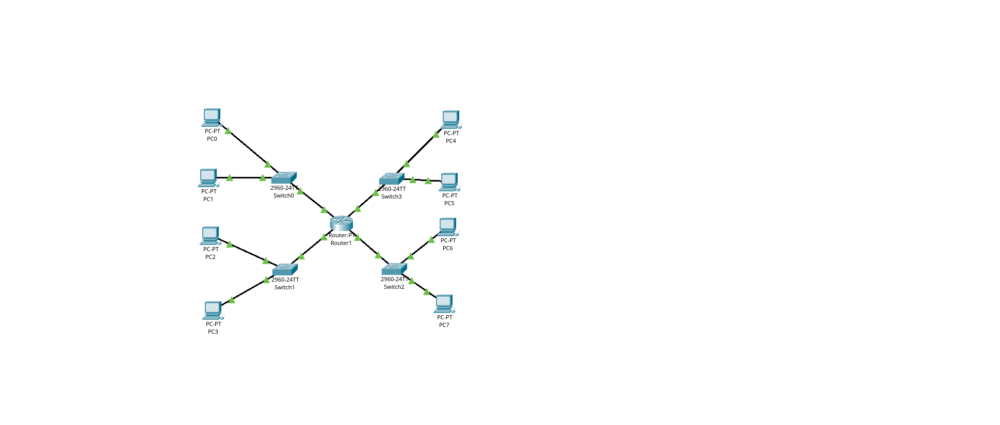
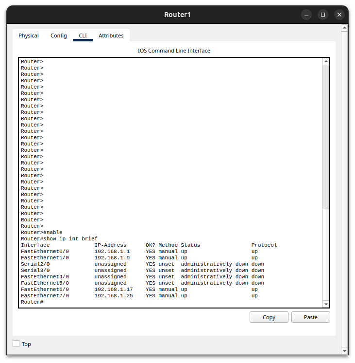
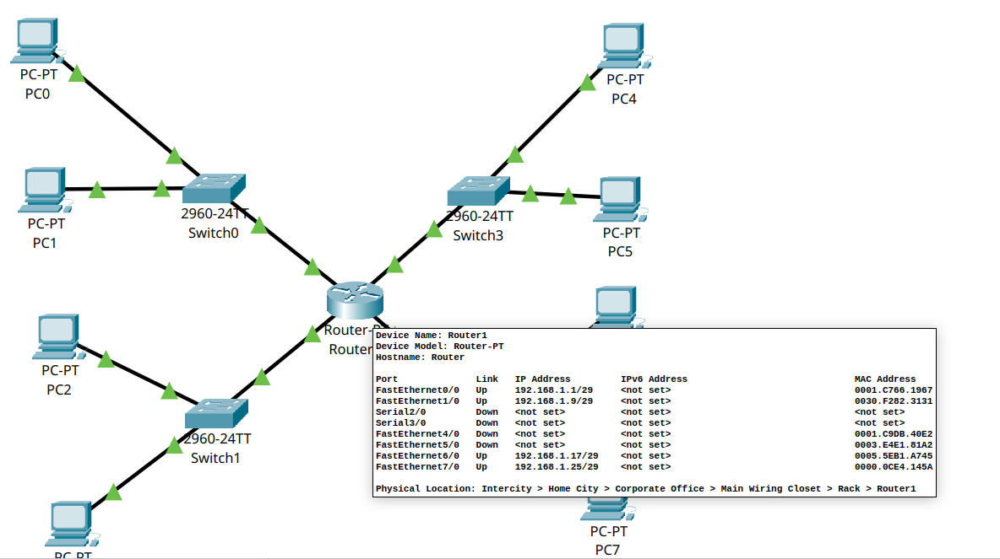
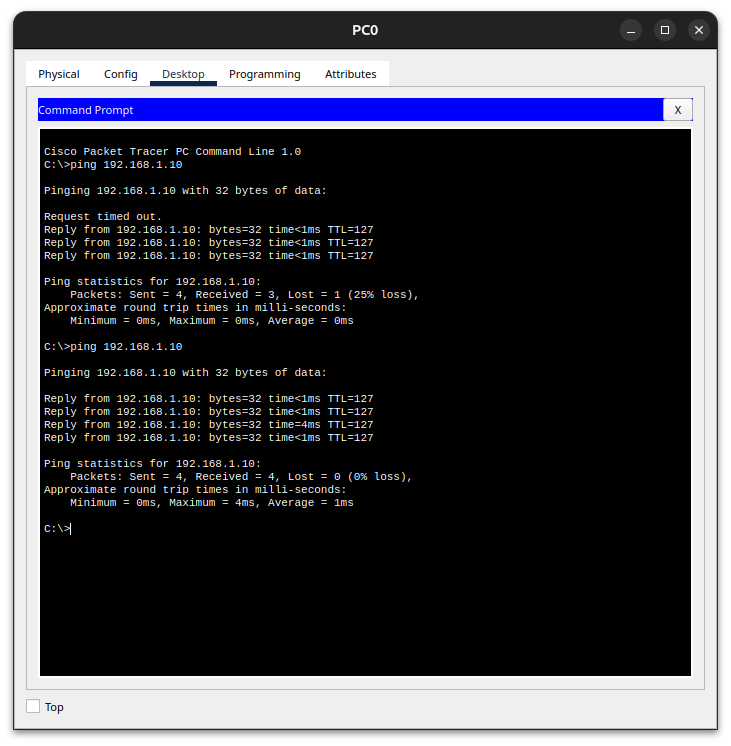

# Lab 2.2 — Subnetting prático

**Abertura:** 2026-05-05
**Etapa 3 concluída:** 2026-05-13
**Fase:** Redes Fundamentos

---

## Objetivo

Aplicar subnetting matemático (Lab 2.1) na prática: dividir uma rede `/24` em 4 sub-redes `/29`, montar a topologia no Packet Tracer e validar com ping intra e inter sub-rede.

---

## Topologia montada



- **8 PCs + 4 switches + 1 roteador** (Router-PT com 4 FastEthernet)
- 2 PCs por switch, cada switch é uma sub-rede `/29`
- Roteador funciona como **gateway das 4 sub-redes**

### Mapa de batalha

| Sub-rede | Bloco | Switch | Interface roteador | Gateway | PC1 | PC2 |
|---|---|---|---|---|---|---|
| 1 | `192.168.1.0/29` | Switch0 | `Fa0/0` | `.1` | `.2` | `.3` |
| 2 | `192.168.1.8/29` | Switch1 | `Fa1/0` | `.9` | `.10` | `.11` |
| 3 | `192.168.1.16/29` | Switch2 | `Fa6/0` | `.17` | `.18` | `.19` |
| 4 | `192.168.1.24/29` | Switch3 | `Fa7/0` | `.25` | `.26` | `.27` |

Máscara em todas: `/29` = `255.255.255.248`.

---

## Por que `/29`?

`/29` = 29 bits de rede + 3 bits de host.

- Sub-redes possíveis em `/24` → `/29`: roubo 5 bits → 2⁵ = **32 sub-redes**
- Hosts úteis por sub-rede: 2³ − 2 = **6** (cobre folgado gateway + 2 PCs = 3)

Trava: **bits de rede + bits de host = 32**. Mais bits roubados = mais sub-redes, mas menos hosts cada.

---

## Cálculo das 4 sub-redes (manual)

Cada sub-rede `/29` ocupa 8 endereços (2³). Os blocos começam em múltiplos de 8 dentro do octeto:

| Sub-rede | Endereço de rede | Broadcast | Hosts úteis |
|---|---|---|---|
| 1 | `192.168.1.0` | `192.168.1.7` | `.1 a .6` |
| 2 | `192.168.1.8` | `192.168.1.15` | `.9 a .14` |
| 3 | `192.168.1.16` | `192.168.1.23` | `.17 a .22` |
| 4 | `192.168.1.24` | `192.168.1.31` | `.25 a .30` |

Endereço de rede = todos bits de host em 0. Broadcast = todos bits de host em 1.

Máscara `/29` em binário: `11111111.11111111.11111111.11111000` = `255.255.255.248`.

---

## IOS CLI — hierarquia de modos

Mini-aula aplicada antes da configuração. Os 4 modos:

| Modo | Prompt | O que faz |
|---|---|---|
| User EXEC | `Router>` | Só olha (`ping`, `show` parcial). Não configura. |
| Privileged EXEC | `Router#` | Vê tudo (`show running-config`), reinicia, salva. |
| Global Config | `Router(config)#` | Configura roteador inteiro (hostname, rotas). |
| Interface Config | `Router(config-if)#` | Configura uma porta específica (IP, máscara, `no shutdown`). |

**Transições:**
- `enable` — sobe de `>` pra `#`
- `configure terminal` (ou `conf t`) — entra em Global Config
- `interface FastEthernet X/Y` — entra na interface específica
- `exit` — sobe um nível
- `end` — vai direto pra Privileged EXEC

---

## Comandos utilizados

| Comando | O que faz |
|---|---|
| `enable` | sobe pra Privileged EXEC |
| `configure terminal` | entra em Global Config |
| `interface FastEthernet0/0` | entra na interface específica |
| `ip address 192.168.1.1 255.255.255.248` | atribui IP + máscara (só em `(config-if)#`) |
| `no shutdown` | liga a porta (Cisco nasce administrativamente desligada) |
| `exit` | sobe um nível |
| `end` | volta direto pra Privileged EXEC |
| `show ip interface brief` | lista todas interfaces, IP, status |
| `show cdp neighbors` | lista dispositivos vizinhos conectados |
| `write memory` | salva running-config em startup-config (persistente) |

---

## Passo a passo

### 1. Pré-requisitos
Cálculo manual das 4 sub-redes `/29` validado (Lab 2.1 fechado + binário + fórmula `2^h − 2`).

### 2. Trocar roteador
Cisco 2911 só tem 3 GigabitEthernet on-board; precisava de 4. Trocado por **Router-PT** com módulos NM-1CFE.

### 3. Cabeamento
- 8 PCs ligados em 4 switches (2 por switch), cabo direto
- 4 switches ligados ao roteador, cabo direto
- `show cdp neighbors` confirmou o mapeamento Switch↔Roteador

### 4. Configurar 4 interfaces do roteador via CLI

Ritual aplicado 4x (uma por interface):

```
enable
configure terminal
interface FastEthernet0/0
ip address 192.168.1.1 255.255.255.248
no shutdown
exit
```

Verificação: `show ip interface brief` mostrou 4 interfaces `up/up` com IPs corretos.



Hover sobre o roteador no canvas mostra topologia + estado das portas integrados:



### 5. Salvar
```
write memory
```
Persiste em NVRAM (sem salvar, perde tudo se reiniciar).

### 6. Configurar 8 PCs (Desktop → IP Configuration → Static)
Cada PC com IP, máscara `/29` e Default Gateway conforme tabela do mapa.

### 7. Teste 1 — Ping intra-sub-rede
`PC0 → PC1` (mesmo Switch0):
```
ping 192.168.1.3
4/4 replies, 0% loss, TTL=128
```

### 8. Teste 2 — Ping inter-sub-rede
`PC0 → PC3` (Switch0 → Roteador → Switch1):
```
ping 192.168.1.10
3/4 replies, primeiro Request timed out, TTL=127
```



A 2ª rodada de ping (mais embaixo no print) já passa 4/4 — ARP em cache, sem timeout. TTL continua 127 em todas as respostas, confirmando que o pacote passa **sempre** pelo roteador.

---

## O que aprendi

**TTL é a prova material do roteamento.** Teste 1 retornou TTL=128 (padrão Windows, não decrementou — não passou por roteador). Teste 2 retornou TTL=127 (decrementou 1 — passou por 1 roteador). Sem essa diferença, "ping passou" seria só fé.

**Primeiro ping falhar não é bug, é ARP.** PC0 nunca tinha falado com PC3, foi perguntar o MAC do gateway antes — enquanto isso, o primeiro ICMP estourou timeout. A partir do segundo, ARP já estava na cache.

**Switch L2 não tem IP nas portas.** Switch trabalha com MAC, não IP. Quem tem IP no segmento é só gateway (interface do roteador) + PCs.

**Endereço de rede ≠ endereço de máquina.** `192.168.1.0` não é o IP de "ninguém" — é o nome do bloco inteiro. Hosts úteis começam no `.1`.

**Hierarquia IOS exige disciplina.** `ip address` em `(config)#` falha — comando só funciona dentro de `(config-if)#`. Sem ler o prompt, não dá pra saber onde está.

---

## Erros que cometi

| Erro | Causa | Correção |
|---|---|---|
| Tentei dar IP ao switch | Confusão entre dispositivo Camada 2 e Camada 3 | Switch L2 só passa quadros — gateway é função do roteador |
| Tratei `192.168.1.0` como IP atribuível | Não distinguia endereço de rede de endereço de host | Endereço de rede = todos bits de host em 0; broadcast = todos em 1; nenhum dos dois é atribuível |
| Li 6 FastEthernet onde havia 4 + 2 Serial | Leitura rápida da saída de `show ip interface brief` | Sempre ler com atenção o tipo de interface, não só o número |
| Digitei `interface FastEthernet6/0` sem perceber que devia ser `2/0` | Ignorei o erro silencioso quando `2/0` não existia (era Serial) | `show cdp neighbors` confirma onde os switches estão cabeados antes de configurar |

---

## Conexão com outros tópicos

- **Aprofunda:** `Mascara-de-Rede.md` — saiu de `/24` para `/29` aplicado
- **Aprofunda:** `Subnetting.md` — primeira aplicação prática do conceito
- **Usa:** `Gateway.md` — cada interface do roteador é gateway da sua sub-rede
- **Usa:** `ARP.md` — confirmado no primeiro timeout do Teste 2
- **Estreia conceito:** `TTL.md` — visto pela primeira vez em ação (128 → 127)
- **Estreia ferramenta:** IOS CLI (4 modos)
- **Vai ser usado em:** Lab 2.3 (DHCP/DNS/NAT vão entrar em cima dessa topologia), AWS VPC subnets, Docker bridge networks, Kubernetes CNI

---

## Ponte DevOps

- **AWS VPC:** dividir uma VPC `10.0.0.0/16` em subnets `/24`, `/26`, `/28` é exatamente isso — define o tamanho do bloco pelo número de hosts que vai abrigar.
- **Multi-AZ deployment:** sub-redes separadas por AZ (us-east-1a, us-east-1b, us-east-1c). O cálculo é o mesmo.
- **Terraform:** `cidrsubnet("10.0.0.0/16", 8, 1)` calcula subnet automaticamente, mas é preciso entender o resultado pra não dimensionar errado.
- **Kubernetes:** cada pod recebe IP de uma sub-rede (CIDR do CNI). Pods em sub-redes diferentes precisam de roteamento — mesma lógica do Teste 2.

---

## Nível de confiança

- [ ] 1 — Não entendi bem, preciso revisar
- [x] 2 — Entendi mas preciso praticar mais (esperando reteste 24h e 72h)
- [ ] 3 — Consigo explicar para alguém sem consultar a nota

---

## Próximos labs

- `2.3-Servicos-de-Rede.md` — DHCP, DNS, NAT em cima dessa topologia
- Reteste 24h: subnetting + IOS + TTL
- Reteste 72h: pergunta de aplicação surpresa
